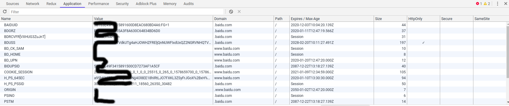

## Cookie 是什么

因为 Http 是无状态的协议 `服务器无法区分客户端是第一次访问还是第几次访问`, Cookie 就诞生了, 最开始就是用来标识用户身份的

下面是百度的 Cookie



由上图可以发现 Cookie 有 name, value, domain, path, MaxAge, size 等属性

## Cookie 原理

Cookie 是服务器发送给客户端的, 客户端存储起来, 然后以后每一次请求都会携带 CooKie

## Cookie 不可跨域

Cookie 是不能跨域的受限于 domain 属性

## Cookie 的属性

- name: 很明显, Cookie 的键名, 不可重复
- value: Cookie 的值, 因为 Cookie 会有 空格, 逗号, 分号, 为了减少不必要的麻烦, 所以**所有的 Cookie 值都需要被编码**
- domain: 域名, 如果设置了顶级域名, 则二级域名如果不同也会生效, 但是如果设置了二级域名, 则不能公用
  - 比如设置 domain='.baidu.com' 在 baike.baidu.com 也生效, 但是如果设置 www.baidu.com, 则不能在百科生效
- path: 路径, Cookie 生效的路径, 默认 /
- Max Age: Cookie 有效期, 设置的时候以秒为单位
- secure: 强制 Cookie 只能通过 SSL 传输
- http-only: 不能通过 JS 脚本获取 Cookie, 预防 XSS 有很大作用

## Cookie 的操作

### JS

```js
document.cookie // 返回当前页面的 Cookie
documet.cookie = 'name=jeden;path=/;domain=jeden.com'
```

### 服务端

express 通过封装好的 API 来设置 Cookie

```js
res.cookie('name', 'value', {
    // 其他属性
})
```


## 跨域 Cookie

如果进行 ajax 跨域请求想要携带 Cookie, 需要进行客户端与服务端的配置

客户端: `原生 XMLHttpRequest`

```js
let xhr = new XMLHttpRequest()
xhr.withCredentials = true
```

服务端:

```js
Access-Control-Allow-Credentials: true
```

