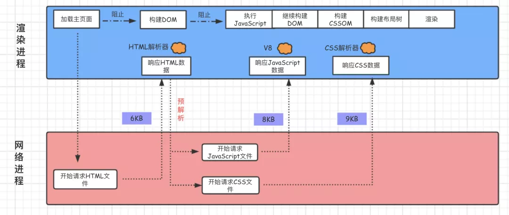

## 浏览器的绘制过程

三个阶段：加载阶段，交互阶段，关闭阶段

加载阶段：从浏览器发出请求到渲染出完整的页面的过程，影响这个过程的主要因素有文件大小，网速，JS文件

交互阶段从页面加载完成一直到关闭的过程，这个过程主要因素是JS

关闭阶段用户发出关闭指令页面做的一些清理操作

我们需要着重关注**加载阶段和交互阶段**

## 加载阶段



从上面的图可以知道，JS、第一次请求的HTML文件、CSS文件是会阻塞第一次渲染的，因为构建DOM树需要HTML和JS，而渲染树则需要CSS

这些资源可以叫做关键资源，着重从这里下手

- 关键资源个数减少（JS，CSS内联`个人不推荐`，JS不操作DOM的情况下加上async或者defer属性）
- 关键资源size（gzip压缩）
- 关键资源请求需要的RTT（网络性能指标）从发送端到接收端的确认需要的时延（cdn）

## 交互阶段


有这几点可以优化

- 避免DOM回流，避免重排和重绘的操作（新图层，防抖，节流）
- 减少JS执行时间
  - 将JS函数分为多个任务，让每一次执行的时间不要太久
  - 使用Web Worker(JS多线程支持)

- DOM操作相关的优化，浏览器具有DOM渲染引擎和JS引擎，当JS操作DOM的时候，这两个引擎需要进行交流，所以每一次操作DOM都是引擎之间解析的性能开销。可以这么做：
  - 缓存计算属性`offsetXX等`
  - 通过变换DOM的class来达到样式的更换，而不是通过style修改
  - 分离读写操作
  - 放弃传统操作DOM的时代，拥抱virtual dom
- 合理利用CSS合成动画，合成动画在合成线程上面进行，和JS线程，布局线程没有关系，如果可以让CSS来操作动画，尽量使用CSS
- CSS选择器优化`css选择器是从右向左匹配`
  - 尽量不使用通配符
  - 少用标签选择器
  - 尽量使用属性继承特性
  - 不要写一大串选择器比如`.wrapper .inner .text ....`这样是会增大浏览器开销的

- JS尽量避免垃圾回收， JS是自动进行垃圾回收的，我们要避免创建太多无用变量

## 缓存

当不强调首屏加载的时候，缓存真的是提升性能的有效办法，下面是缓存的作用


缓存的知识


## DNS优化


一般来说，DNS解析时间是20-120ms，挺快的，但是如果一个页面引用了很多外界不同域名下的图片或者其他资源文件，就用到了预解析DNS

## 预解析DNS

有两种方式

```html
<meta http-equiv="x-dns-prefetch-control" content="on">
```

这种会解析整个页面的DNS

下一种

```html
<link rel="dns-prefetch" href="//img10.360buyimg.com"/>
```

解析单个域名的DNS

参考奇舞周刊[前端森林-crp性能优化](https://mp.weixin.qq.com/s?__biz=MzA5NzkwNDk3MQ==&mid=2650592497&idx=1&sn=66c3b5d446cd16917b43a72a3bc1330c&chksm=8891c4d5bfe64dc3e3508837d4b8069f6f9f99139d87378e337169fcaf94d0ac50923d089e62&mpshare=1&scene=1&srcid=0719ZAiGL3FkUv4FWGlkevBb&sharer_sharetime=1595162228631&sharer_shareid=e37b40aa7babffac013069883e01d363&exportkey=AfpTjMnNbf28H18cmr%2FCz24%3D&pass_ticket=lpG%2BspwQ0mIzGENecyHTvQ1DOs6ihFsuT4uq4DxpiA8s3qkHPdYDZMPBuz1SxsQ5&wx_header=0#rd)