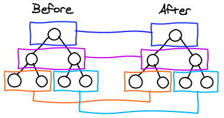

## 前言

前面两篇实现了[虚拟 DOM 创建 DOM 元素]([https://jedenzhan.github.io/2020/02/19/React%E5%AE%9E%E7%8E%B0%E8%99%9A%E6%8B%9FDOM/](https://jedenzhan.github.io/2020/02/19/React实现虚拟DOM/)) \ [自定义 React 组件生成 DOM, 自定义组件的更新]([https://jedenzhan.github.io/2020/03/07/React%E7%9A%84%E7%BB%84%E4%BB%B6%E5%8C%96%E6%9C%BA%E5%88%B6/](https://jedenzhan.github.io/2020/03/07/React的组件化机制/))

## React 对比策略



React 整体是由组件构成的, React 在 diff 的过程先进行全局的 diff, 找到需要更新的组件, 然后对比内部的真实DOM

如果是两棵树完整的对比, 复杂度是O(n^3), 但是 React 是只对比层级的变化, 时间复杂度为 O(n)

## 工具函数

包含取消挂载组件, 判断是不是一个类型的 DOM, 删除节点

```js
const removeNode = node => { // 删除节点
    if (node && node.parentNode) {
        node.parentNode.removeChild(node)
    }
}

const unMountComponent = component => { // 取消挂载组件
    if (component.componentWillUnmount) component.componentWillUnmount() // 执行删除组件生命周期函数
    removeNode(component.base)
}

const isSameNodeType = (dom, vnode) => { // 是不是一样类型的节点
    if (typeof vnode === 'string' || typeof vnode === 'number') {
        return dom.nodeType === 3
    }
    if (typeof vnode.tag === 'string') {
        return dom.nodeName.toLowerCase() === vnode.tag.toLowerCase()
    }
    return dom && dom._component && dom._component.constructor === vnode.tag
}
```

## 对比主体函数

拿到旧的 DOM 和新的虚拟 DOM, 根据新的虚拟 DOM 来更新旧 DOM

```js
const diffNode = (dom, vnode) => {
    let out = dom // 基于原始dom进行修改
    if (!vnode || typeof vnode === 'boolean') vnode = ''
    if (typeof vnode === 'number') vnode = String(vnode)
    if (typeof vnode === 'string') {
        if (dom && dom.nodeType === 3) { // 如果原生节点是文本节点, 比较完直接替换
            (dom.textContent !== vnode) && (dom.textContent = vnode)
        } else {
            out = document.createTextNode(vnode)
            if (dom && dom.parentNode) {
                dom.parentNode.replaceChild(out, dom)
            }
        }
        return out
    }

    if (typeof vnode.tag === 'function') {
        return diffComponent(dom, vnode) // 对比组件
    }

    if (!dom || !isSameNodeType(dom, vnode)) { // 没有初始 dom, 是第一次挂载
        out = document.createElement(vnode.tag)
        if (dom) {
            [...dom.childNodes].forEach(out.appendChild) // 这个操作有点骚....将dom节点的子元素转移到新节点里面
            if (dom.parentNode) dom.parentNode.replaceChild(out, dom)
        }
    }

    if (vnode.children && vnode.children.length > 0 || out.childNodes && out.childNodes.length > 0) {
        diffChildren(out, vnode.children) // 对比子节点
    }

    diffAttributes(out, vnode) // 对比属性值
    return out // 返回更新完的 DOM
}
```

## 对比组件

```js
const diffComponent = (dom, vnode) => {
    let c = dom && dom._component || {}
    let oldDom = dom
    if (c.constructor === vnode.tag) { // 说明组件类型未变化
        setComponentProps(c, vnode.attrs)
        dom = c.base
    } else { // 如果组件类型不同, 删除原来的组件, 替换新的组件
        if (c) {
            unMountComponent(c)
            oldDom = null
        }

        c = createComponent(vnode.tag, vnode.attrs) // 创建新的组件
        setComponentProps(c, vnode.attrs)
        dom = c.base // 记得吗, base保存的是更新前的 DOM

        if (oldDom && dom !== oldDom) {
            oldDom._component = null
            removeNode(oldDom)
        }
    }
    return dom
}
```

## 对比属性

```js
const diffAttributes = (dom, vnode) => {
    const old = {} // 当前DOM的属性
    const attrs = vnode.attrs // 虚拟DOM的属性

    for (let i = 0; i < dom.attributes.length; i++) {
        const attr = dom.attributes[i]
        old[attr.name] = attr.value
    }

    // 如果原来的属性不在新的属性当中，则将其移除掉（属性值设为undefined）
    for (let name in old) {
        if (name === 'class') name = 'className'
        if (/on\w+/.test(name)) name = name.toLowerCase()
        if (!(name in attrs)) {
            setAttribute(dom, name, undefined)
        }
    }

    // 更新新的属性值
    for (let name in attrs) {
        if (old[name] !== attrs[name]) {
            setAttribute(dom, name, attrs[name])
        }
    }
}
```

## 对比子节点

前面的对比还算是简单, 因为都是一个层级的对比, 但是, 子节点的对比就没那么简单了

在这里你也可以看到 key 的真正的作用

```js
const diffChildren = (dom, vchildren) => {
    const domChildren = dom.childNodes,
          children = [],
          keyed = {}, // 用于保存有 key 的子节点
          len = domChildren.length

    if (len > 0) {
        for (let i = 0; i < len; i++) {
            let item = domChildren[i]
            let key = item.key
            if (key) {
                keyed[key] = item // 保存有key的item
            } else {
                children.push(item) // 没有key的保存在子节点数组
            }
        }
    }
    if (vchildren && vchildren.length > 0) {
        let min = 0,
            childrenLen = children.length
        for (let i = 0, len = vchildren.length; i < len; i++) {
            const vitem = vchildren[i]
            const key = vitem.key
            let child
            if (key) {
                if (keyed[key]) { // 如果有 key 保存, 直接拿来用
                    child = keyed[key]
                    delete keyed[key]
                }
            } else if (min < childrenLen) {
                // 如果没有 key
                for (let j = min; j < childrenLen; j++) {
                    let c = children[j]
                    if (c && isSameNodeType(c, vitem)) { // 优先寻找类型相同的元素
                        child = c
                        children[j] = undefined
                        if (j === childrenLen - 1) childrenLen--
                        if (j === min) min++
                        break
                    }
                }
            }

            child = diffNode(child, vitem) // 继续对比子节点

            const f = domChildren[i]
            if (child && child !== dom && child !== f) {
                if (!f) {
                    dom.appendChild(child)
                } else if (child === f.nextSibling) {
                    removeNode(f)
                } else {
                    dom.insertBefore(child, f)
                }
            }
        }
    }
}
```

## diff 写好了, 用起来

在之前的 render 文件里, 修改以下两个函数

```js
function render(vnode, container, dom) {
  return diff(dom, vnode, container)
}

export const renderComponent = component => {
  let base
  const renderer = component.render() // 这里执行返回内部的虚拟或者真实 DOM
  if (component.base && component.componentWillUpdate) {
    console.log('组件需要更新')
    component.componentWillUpdate()
  }
  base = diff(component.base, renderer)
  if (!component.base && component.componentDidMount) component.componentDidMount()
  if (component.base && component.componentDidUpdate) component.componentDidUpdate()

  component.base = base
  base._component = component
}
```

篇幅有点长, 仔细看看还算可以理解的

