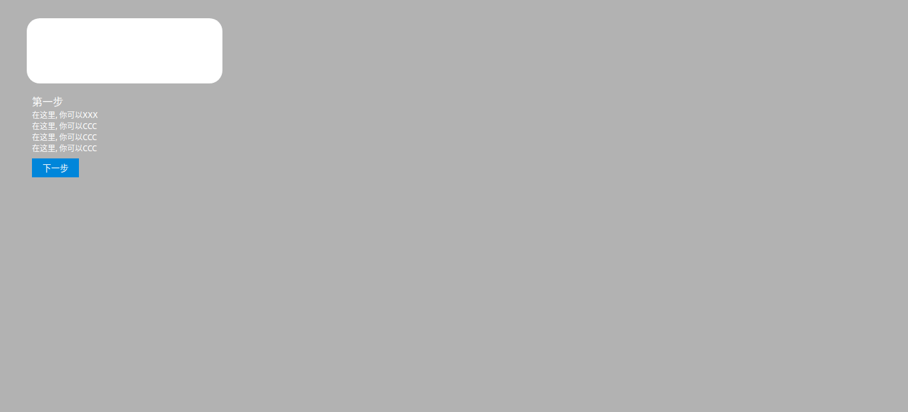

## 前言

在我们的功能性网站第一次被访问的时候, 一个新手引导是比较常见的, 本文带你实现一个简单的新手引导插件

(基于React)

本插件实现效果



## 需求分析

1. 一个高亮的区域, 其余区域为灰色
2. 下面有提示文字和按钮用来点击下一步
3. 高亮区域最好是过渡效果

## 开始实现

其实总体来说难度不高, 第一个效果的实现方式为 **阴影**

阴影的骚操作之一?

```html
<div class="main"></div>
<style>
    .main {
        height: 100px;
        width: 200px;
    	box-shadow: 0 0 0 10000px rgba(0, 0, 0, .3);
    }
</style>
```

这样的阴影就会覆盖整个屏幕, 达到第一个需求的效果


完整代码以及注释如下:

```jsx
import React, { Fragment, useState, useEffect } from 'react'
import './assets/style/index.css'

const Guide = props => {
    // 获取 配置文件
    const config = props.config,
          describtions = config.describtions,
          steps = config.steps || describtions.length

    const [step, nextStep] = useState(1),
          [show, setShow] = useState(true)

    let currentDescribtion = describtions[step - 1]
    useEffect(() => {
        if (step > steps) setShow(false) // 如果步数达到了就不显示喽
    }, [step])


    const { title = "说明", top = "100px", left = "100px", highLight = {}, subDescs = [] } = currentDescribtion || {},
          { width = 'auto', height = 'auto' } = highLight
    return (
        <Fragment>
            <div className="main" style={{
                    display: !show && 'none',
                        top,
                        left,
                        width,
                        height
                }}>
                <p className="exp" style={{ display: 'none' }}>需要选中的地方</p>
                <div className="describtion" style={{ bottom: `${-subDescs.length - 5}rem` }}>
                    <p className="title">{title}</p>
                    <ul className="sub-desc">
                        {
                            subDescs.map(desc => <li>{desc}</li>)
                                         }
                    </ul>
                    <button className="next-step" onClick={() => { nextStep(step + 1) }}>{step === steps ? '我知道了' : '下一步'}</button>
                </div>
            </div>
        </Fragment>
    )
}

export default Guide
```

```css
* {
    margin: 0;
    padding: 0;
}

.main {
    position: fixed;
    top: 20vh;
    left: 20vh;
    padding: .5rem;
    box-sizing: border-box;
    box-shadow: 0 0 0 10000px rgba(0, 0, 0, .3);
    border-radius: 20px;
    transition: all .5s;
}

.exp {
    color: #1296db;
}

.describtion {
    position: absolute;
    width: 500px;
}

.title {
    color: #fff;
}

.sub-desc {
    list-style: none;
    color: #fff;
    font-size: .5rem;
}

.next-step {
    background-color: #1296db;
    border: none;
    margin-top: .5rem;
    padding: .3rem 1rem;
    color: #fff;
    outline: none;
}

.next-step:active {
    background-color: #1296aa;
}
```

会尽快发布到npm啦